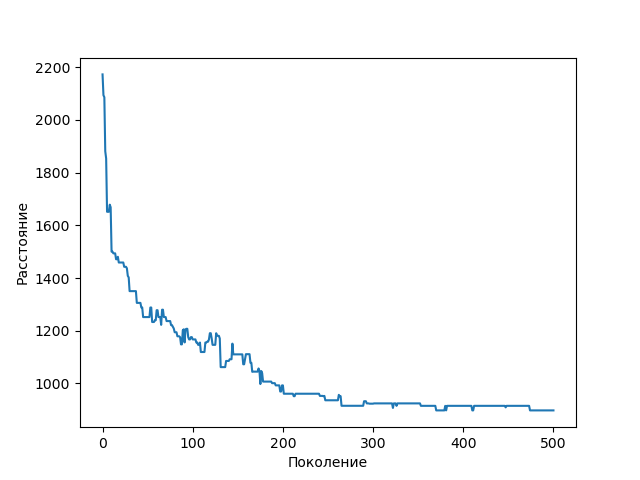

# Traveling salesman problem 

In the theory of computational complexity, the travelling salesman problem (TSP) asks the following question: "Given a list of cities and the distances between each pair of cities, what is the shortest possible route that visits each city exactly once and returns to the origin city?" It is an NP-hard problem in combinatorial optimization, important in theoretical computer science and operations research.

This repository is an old project of mine and an attempt to create a solution for TSP problem using genetic algorithm. 

Solution:



## Run on NixOS

```shell
  nix develop --impure
```  

## Dependencies

* numpy
* pandas
* matplotlib
